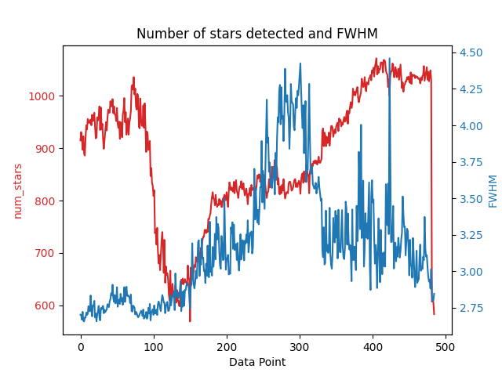
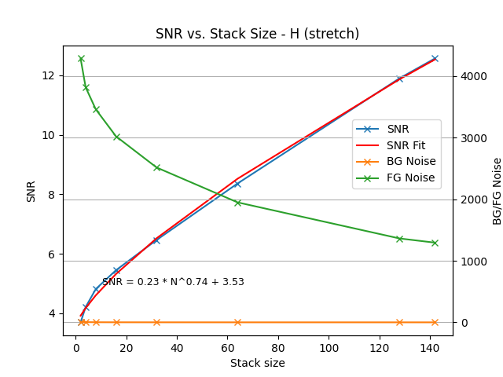

# SkyScripter

SkyScripter is a collection of scripts to automate setup, capture, and analysis for 
astrophotography. It builds upon several existing excellent astrophotography tools:
* [GPhoto](http://www.gphoto.org/) for image capture and camera control
* [Siril](https://siril.org/) for astrometry (plate-solving, star analysis) and stacking
* [PhD2](https://openphdguiding.org/) for auto-guiding
* [ASTAP](https://www.hnsky.org/astap.htm) for plate-solving
* [OpenCV](https://opencv.org/) for image analysis
* [LibINDI](https://indilib.org/) for controlling and querying astrophotography equipment

## Requirements
In addition to the above, you will need the following:
* A Python3 environment (tested with 3.9.12 on Mac OS and 3.10.12 on Ubuntu 22.04)
* The following Python packages: 
    * `astroquery`
    * `argparse`
    * `astropy`
    * `matplotlib`
    * `opencv-python`
    * `numpy` 
    * `scipy`
  
You can install these with `pip3 install -r requirements.txt`


## Setup Scripts

* `startup.py` - Initializes the INDI telescope and camera, and sets the site information.
* `read_site.py` - Reads the current site information from the INDI telescope and prints it to the console.
* `goto.py` - Moves the telescope to a specified target.
* `capture_and_sync.py` - Captures an image and syncs the telescope to the target using plate-solving. 
* `align.py` - Aligns the telescope to a target using iterative capture, plate-solving, and adjustment.
* `focus_manual.py` - Assists with manual focusing of a telescope by capturing images, and displaying the number of stars and the mean FWHM.
* `set_tracking.py` - Sets the tracking mode of the telescope to sidereal, lunar, or solar, and turns tracking on or off.

## Capture Scripts

* `batch_capture.py` - Captures a series of images with the camera, and saves them to a directory.
* `auto_meridian_flip.py` - Monitors the mount, and automatically performs a meridian flip when the telescope crosses the meridian.


## Analysis Scripts

* `python batch_solve.py` - Batch plate-solving and star analysis of images in a directory, useful for extracting metrics of image quality (number of stars, FWHM) during a session. Sample graph:


* `noise_plot.py` - Analyzes noise statistics and signal-to-noise ratio (SNR) for different stack sizes. This script helps determine the optimal number of frames to stack for achieving desired SNR targets.

### Noise Analysis with noise_plot.py

The `noise_plot.py` script performs comprehensive noise analysis on calibrated light frames by:
1. Creating sub-stacks of different sizes (2, 4, 8, 16, etc. frames)
2. Removing stars from each stack using StarNet
3. Measuring noise statistics in specified regions
4. Calculating SNR and fitting a power law curve
5. Generating plots showing SNR vs. stack size

#### Usage

```bash
python analysis/noise_plot.py <input_directory> <output_directory> [options]
```

**Arguments:**
- `input_directory`: Directory containing calibrated `pp_light_*.fit` files
- `output_directory`: Directory where results will be saved

**Options:**
- `-graph`: Skip processing, just generate the graph from existing data
- `-nostretch`: Do not stretch the starless images before analysis
- `-config <file>`: Path to configuration file (default: `noise_stats_config.json`)

#### Configuration

Create a `noise_stats_config.json` file with regions for background and noise measurement:

```json
{
  "background_region": {
    "x": 1165,
    "y": 997,
    "w": 117,
    "h": 83
  },
  "noise_region": {
    "x": 2712,
    "y": 2252,
    "w": 73,
    "h": 53
  }
}
```

- `background_region`: Region used to measure background level (avoid stars and nebulosity)
- `noise_region`: Region used to measure noise statistics (should be empty sky)

#### Output

The script generates a plot showing SNR vs. stack size with fitted curve, and prints out SNR values
for different stack sizes. Sample output:
```
starless_stack_0002.fit: Mean: 314.30, Median: 313.60, Sigma:   9.00, Min: 288.40, Max: 365.00, bgnoise:   8.40 bg: 311.90 SNR:   0.27
starless_stack_0004.fit: Mean: 119.40, Median: 119.30, Sigma:   3.90, Min: 107.00, Max: 139.00, bgnoise:   3.50 bg: 117.60 SNR:   0.46
starless_stack_0008.fit: Mean:  61.70, Median:  61.70, Sigma:   2.30, Min:  53.50, Max:  71.50, bgnoise:   2.20 bg:  59.90 SNR:   0.78
starless_stack_0016.fit: Mean:  59.50, Median:  59.40, Sigma:   1.40, Min:  54.00, Max:  65.40, bgnoise:   1.40 bg:  57.90 SNR:   1.14
starless_stack_0032.fit: Mean:  63.10, Median:  63.10, Sigma:   1.10, Min:  58.60, Max:  67.50, bgnoise:   1.00 bg:  61.50 SNR:   1.45
starless_stack_0064.fit: Mean:  22.90, Median:  22.90, Sigma:   0.80, Min:  19.80, Max:  25.80, bgnoise:   0.70 bg:  21.30 SNR:   2.00
starless_stack_0128.fit: Mean:   6.40, Median:   6.30, Sigma:   0.60, Min:   4.50, Max:   8.60, bgnoise:   0.50 bg:   4.70 SNR:   2.83
starless_stack_0142.fit: Mean:   6.30, Median:   6.30, Sigma:   0.60, Min:   4.50, Max:   8.50, bgnoise:   0.40 bg:   4.70 SNR:   2.67
Desired stack size for SNR=10.0:  5250
Desired stack size for SNR=12.0:  9081
Desired stack size for SNR=14.0: 14490
Desired stack size for SNR=16.0: 21773
Desired stack size for SNR=18.0: 31235
```

Example output:  


### Notes

Mac OS users can install GPhoto with [Homebrew](https://brew.sh/):

```bash
brew install gphoto2
```
An annoying issue with Mac OS is that it automatically starts a daemon to
connect with the camera, and claims the camera USB device as soon as it is
connected, preventing GPhoto from accessing it. To prevent this, you can
disable the daemon with the following command:

```bash
sudo launchctl unload /System/Library/LaunchAgents/com.apple.ptpcamerad.plist
sudo launchctl disable gui/501/com.apple.ptpcamerad
```

Reference: https://discussions.apple.com/thread/254703577
